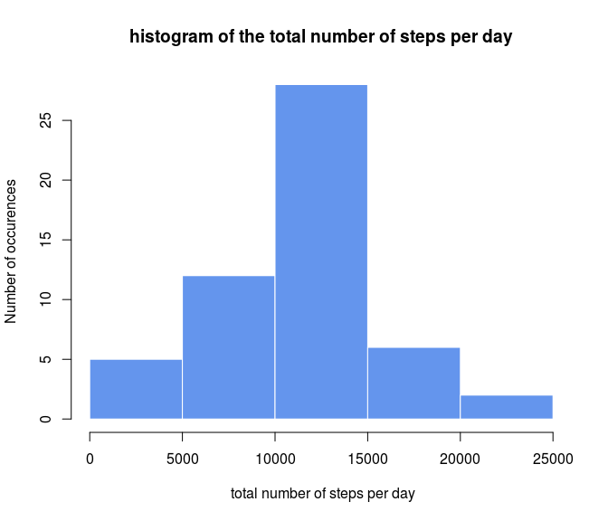
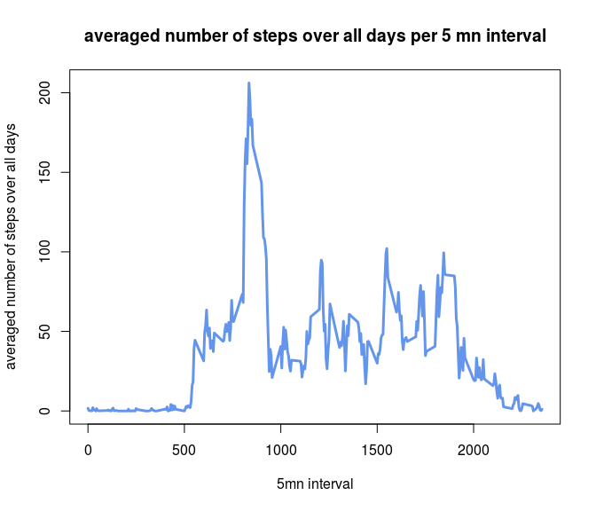
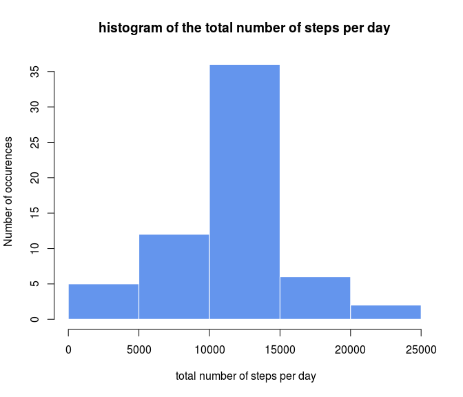
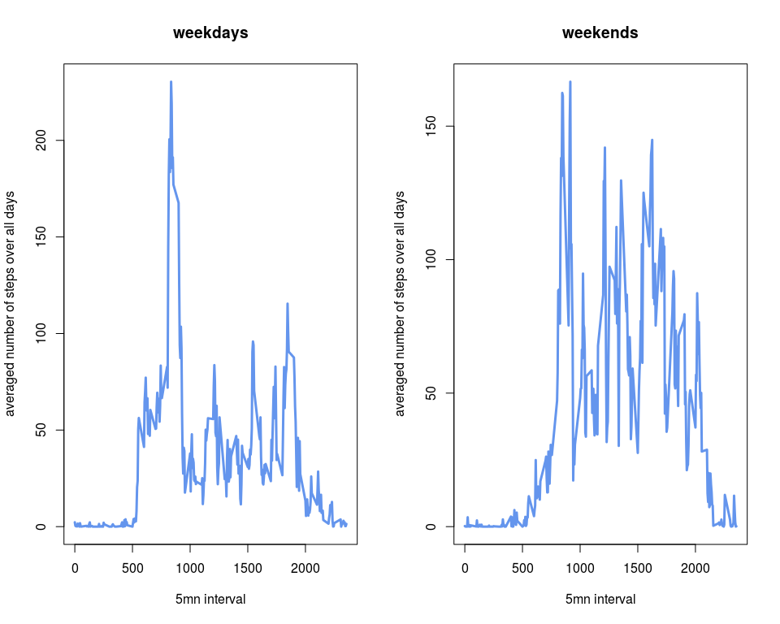

PA1 for the reproducible research class
=======================================

Introduction
------------

This Readme file performs the analysis required in order to complete the
Project assignement 1 for the reproducible research class.

In order to be successfully reviewed, we need to allow for our r code
chunks to be seen, we therefore set the global option

    library(knitr)
    opts_chunk$set(echo=TRUE)

Loading the data
----------------

The first step towards the completion of the project is to load the data

    activity<-read.csv("activity.csv",sep=",",header=TRUE)

Number of steps per day, mean and median
----------------------------------------

We use the very handy tapply function, the index being the date, we
store the result in a variable `sumstep` for future analysis.**Note that
we exclude the days where there are only NA values from our analysis.
Consequently, these days (there are 8 of them) don't appear in sumstep**

    sumstep<-tapply(activity$steps, activity$date,  FUN =sum)[
        !is.na(tapply(activity$steps, activity$date,  FUN =sum))]
    sumstep

    ## 2012-10-02 2012-10-03 2012-10-04 2012-10-05 2012-10-06 2012-10-07 
    ##        126      11352      12116      13294      15420      11015 
    ## 2012-10-09 2012-10-10 2012-10-11 2012-10-12 2012-10-13 2012-10-14 
    ##      12811       9900      10304      17382      12426      15098 
    ## 2012-10-15 2012-10-16 2012-10-17 2012-10-18 2012-10-19 2012-10-20 
    ##      10139      15084      13452      10056      11829      10395 
    ## 2012-10-21 2012-10-22 2012-10-23 2012-10-24 2012-10-25 2012-10-26 
    ##       8821      13460       8918       8355       2492       6778 
    ## 2012-10-27 2012-10-28 2012-10-29 2012-10-30 2012-10-31 2012-11-02 
    ##      10119      11458       5018       9819      15414      10600 
    ## 2012-11-03 2012-11-05 2012-11-06 2012-11-07 2012-11-08 2012-11-11 
    ##      10571      10439       8334      12883       3219      12608 
    ## 2012-11-12 2012-11-13 2012-11-15 2012-11-16 2012-11-17 2012-11-18 
    ##      10765       7336         41       5441      14339      15110 
    ## 2012-11-19 2012-11-20 2012-11-21 2012-11-22 2012-11-23 2012-11-24 
    ##       8841       4472      12787      20427      21194      14478 
    ## 2012-11-25 2012-11-26 2012-11-27 2012-11-28 2012-11-29 
    ##      11834      11162      13646      10183       7047

We then display the histogram of th total number of steps per day

    hist(sumstep,breaks=5, col="cornflowerblue", border="white",
        main="histogram of the total number of steps per day",
        xlab=" total number of steps per day", ylab="Number of occurences",
        xlim=c(0,25000))

Finally, the mean the median are just computed using the corresponding
functions, thanks to the `sumstep` variable previously stored

    mean(sumstep)

    ## [1] 10766.19

    median(sumstep)

    ## [1] 10765

averaged number of steps per interval
-------------------------------------

We use again the tapply function, the index being now the interval. We
store the result in a variable`meaninterval` Note that we exclude the NA
values from our analysis (we don't show the result to save place)

    meaninterval<-tapply(activity$steps, activity$interval,  FUN =mean,na.rm=TRUE)

We know make the required time series plot

    plot(activity$interval[1:length(meaninterval)],meaninterval,type="l",
         xlab="5mn interval",ylab="averaged number of steps over all days",
         col="cornflowerblue",lwd=3,
         main="averaged number of steps over all days per 5 mn interval")

The maximum 5 mn interval is easily found thanks to

    names(which.max(meaninterval))

    ## [1] "835"

which corresponds to the value

    meaninterval[which.max(meaninterval)]

    ##      835 
    ## 206.1698

Missing data
------------

To find the number of missing data, we just use apply on the first
column of our dataframe

    sum(apply(activity,1,FUN=is.na))

    ## [1] 2304

To fill these missing data, we will use one of the strategies advocated
by the project assignement, namely replacing the NA by the correponding
5 mn averaged number of steps over all days

    a<-replace(activity$steps,is.na(activity$steps),meaninterval)

we then create our new dataset without NA values

    fullactivity<-activity
    fullactivity$steps<-a

Defining the variable corresponding to the total number of steps taken
each day

    fullsumstep<-tapply(fullactivity$steps, fullactivity$date,  FUN =sum)
    fullsumstep

    ## 2012-10-01 2012-10-02 2012-10-03 2012-10-04 2012-10-05 2012-10-06 
    ##   10766.19     126.00   11352.00   12116.00   13294.00   15420.00 
    ## 2012-10-07 2012-10-08 2012-10-09 2012-10-10 2012-10-11 2012-10-12 
    ##   11015.00   10766.19   12811.00    9900.00   10304.00   17382.00 
    ## 2012-10-13 2012-10-14 2012-10-15 2012-10-16 2012-10-17 2012-10-18 
    ##   12426.00   15098.00   10139.00   15084.00   13452.00   10056.00 
    ## 2012-10-19 2012-10-20 2012-10-21 2012-10-22 2012-10-23 2012-10-24 
    ##   11829.00   10395.00    8821.00   13460.00    8918.00    8355.00 
    ## 2012-10-25 2012-10-26 2012-10-27 2012-10-28 2012-10-29 2012-10-30 
    ##    2492.00    6778.00   10119.00   11458.00    5018.00    9819.00 
    ## 2012-10-31 2012-11-01 2012-11-02 2012-11-03 2012-11-04 2012-11-05 
    ##   15414.00   10766.19   10600.00   10571.00   10766.19   10439.00 
    ## 2012-11-06 2012-11-07 2012-11-08 2012-11-09 2012-11-10 2012-11-11 
    ##    8334.00   12883.00    3219.00   10766.19   10766.19   12608.00 
    ## 2012-11-12 2012-11-13 2012-11-14 2012-11-15 2012-11-16 2012-11-17 
    ##   10765.00    7336.00   10766.19      41.00    5441.00   14339.00 
    ## 2012-11-18 2012-11-19 2012-11-20 2012-11-21 2012-11-22 2012-11-23 
    ##   15110.00    8841.00    4472.00   12787.00   20427.00   21194.00 
    ## 2012-11-24 2012-11-25 2012-11-26 2012-11-27 2012-11-28 2012-11-29 
    ##   14478.00   11834.00   11162.00   13646.00   10183.00    7047.00 
    ## 2012-11-30 
    ##   10766.19

we do the same histogram as in part 1 with this new dataset

    hist(fullsumstep,breaks=5, col="cornflowerblue", border="white",
        main="histogram of the total number of steps per day",
        xlab=" total number of steps per day", ylab="Number of occurences",
        xlim=c(0,25000))

Finally, the mean the median are just computed using the corresponding
functions, thanks to the `fullsumstep` variable previously stored

    mean(fullsumstep)

    ## [1] 10766.19

    median(fullsumstep)

    ## [1] 10766.19

we find that the mean is unchanged, while the median is now slightly
changed, and equal to the mean. This makes perfect sense, as we
completed the missing data (corresponding to 8 full days) with the 5 mn
averaged over all days, and summing over the full day it gives a total
number of steps equal to the mean. So the mean is obviously left
unchanged, and since we added 8 "mean values" the median is now equal
one of these values, hence the mean.

Impact of the day of the week
-----------------------------

TO create our new factor we start by creating our weekday vector (sorry
for the french names :)

    weekday<-c("lundi","mardi","mercredi","jeudi","vendredi")

and we then create the new column of our dataframe with the ifelse
command

    fullactivity$weektime<-as.factor(ifelse(weekdays(
        strptime( fullactivity$date,"%Y-%m-%d")) %in% weekday,"weekday","weekend"))

With this additional index, we create the 5 mn interval averaged over
either all weekdays or all weekends

    weekmeaninterval<-tapply(fullactivity$steps,
        list(fullactivity$interval,fullactivity$weektime),  FUN =mean)

That allow us to perform the required analysis

     par(mfrow=c(1,2))
    plot(fullactivity$interval[1:length(weekmeaninterval[,1])],weekmeaninterval[,1],type="l",
        xlab="5mn interval",ylab="averaged number of steps over all days",
        col="cornflowerblue",lwd=3,
        main="weekdays")
    plot(fullactivity$interval[1:length(weekmeaninterval[,2])],weekmeaninterval[,2],type="l",
        xlab="5mn interval",ylab="averaged number of steps over all days",
        col="cornflowerblue",lwd=3,
        main="weekends")

